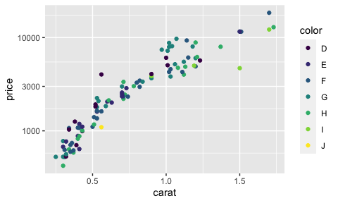

<!-- README.md is generated from README.Rmd. Please edit that file -->

# scales 

<!-- badges: start -->

[](https://CRAN.R-project.org/package=scales)
[](https://travis-ci.org/hadley/scales)
[](https://codecov.io/gh/hadley/scales?branch=master)
<!-- badges: end -->

# Overview

One of the most difficult parts of any graphics package is scaling,
converting from data values to perceptual properties. The inverse of
scaling, making guides (legends and axes) that can be used to read the
graph, is often even harder\! The scales packages provides the internal
scaling infrastructure to [ggplot2](github.com/tidyverse/ggplot2) and
its functions allow users to customize the transformations, breaks,
guides and palettes used in visualizations.

The idea of the scales package is to implement scales in a way that is
graphics system agnostic, so that everyone can benefit by pooling
knowledge and resources about this tricky topic.

# Installation

``` r
# Scales is installed when you install ggplot2 or the tidyverse.
# But you can install just scales from CRAN:
install.packages("scales")

# Or the development version from Github:
# install.packages("devtools")
devtools::install_github("r-lib/scales")
```

# Usage

### Formatters

Outside of ggplot2 where it powers all the aesthetic scales, axes
formatting, and data transformations internally, the scales package also
provides useful helper functions for formatting numeric data for all
types of presentation.

``` r
library(scales)
set.seed(1234)

# percent() function takes a numeric and does your division and labelling for you
percent(c(0.1, 1 / 3, 0.56))
#> [1] "10.0%" "33.3%" "56.0%"

# comma() adds commas into large numbers for easier readability
comma(10e6)
#> [1] "10,000,000"

# dollar() adds currency symbols
dollar(c(100, 125, 3000))
#> [1] "$100"   "$125"   "$3,000"

# unit_format() adds unique units
# the scale argument can do simple conversion on the fly
unit_format(unit = "ha", scale = 1e-4)(c(10e6, 10e4, 8e3))
#> [1] "1 000 ha" "10 ha"    "1 ha"
```

All of these formatters are based on the underlying `number()` formatter
which has additional arguments that allow further customisation. This
can be especially useful for meeting diverse international standards.

``` r
# for instance, European number formatting is easily set:
number(c(12.3, 4, 12345.789, 0.0002), big.mark = ".", decimal.mark = ",")
#> [1] "12"     "4"      "12.346" "0"

# these functions round by default, but you can set the accuracy
number(c(12.3, 4, 12345.789, 0.0002),
  big.mark = ".",
  decimal.mark = ",",
  accuracy = .01
)
#> [1] "12,30"     "4,00"      "12.345,79" "0,00"

# percent formatting in the French style
french_percent <- percent_format(decimal.mark = ",", suffix = " %")
french_percent(runif(10))
#>  [1] "11,4 %" "62,2 %" "60,9 %" "62,3 %" "86,1 %" "64,0 %" "0,9 %" 
#>  [8] "23,3 %" "66,6 %" "51,4 %"

# currency formatting Euros (and simple conversion!)
usd_to_euro <- dollar_format(prefix = "", suffix = "\u20ac", scale = .85)
usd_to_euro(100)
#> [1] "85€"
```

### Colour palettes

These are used to power the scales in ggplot2, but you can use them in
any plotting system. The following example shows how you might apply
them to a base plot.

``` r
# pull a list of colours from any palette
viridis_pal()(4)
#> [1] "#440154FF" "#31688EFF" "#35B779FF" "#FDE725FF"

# use in combination with baseR `palette()` to set new defaults
palette(brewer_pal(palette = "Set2")(4))
plot(Sepal.Length ~ Sepal.Width, data = iris, col = Species, pch = 20)
```

<!-- -->

### Bounds, breaks, & transformations

scales provides a handful of functions for rescaling data to fit new
ranges.

``` r
# squish() will squish your values into a specified range
squish(c(-1, 0.5, 1, 2, NA), range = c(0, 1))
#> [1] 0.0 0.5 1.0 1.0  NA

# Useful for setting the `oob` argument for a colour scale with reduced limits
library(ggplot2)
ggplot(iris, aes(x = Sepal.Length, y = Sepal.Width, colour = Petal.Length)) +
  geom_point() +
  scale_color_continuous(limit = c(2, 4), oob = scales::squish)
```

<!-- -->

``` r
# the rescale functions can rescale continuous vectors to new min, mid, or max values
x <- runif(5, 0, 1)
rescale(x, to = c(0, 50))
#> [1] 32.063194 20.465217  0.000000 50.000000  0.747796
rescale_mid(x, mid = .25)
#> [1] 0.8293505 0.7190081 0.5243035 1.0000000 0.5314180
rescale_max(x, to = c(0, 50))
#> [1] 37.55502 29.50807 15.30882 50.00000 15.82766
```

scales also gives users the ability to define and apply their own custom
transformation functions for repeated use.

``` r
# use trans_new to build a new transformation
logp3_trans <- trans_new(
  name = "logp",
  trans = function(x) log(x + 3),
  inverse = function(x) exp(x) - 3,
  breaks = log_breaks()
)

library(dplyr)
dsamp <- sample_n(diamonds, 100)
ggplot(dsamp, aes(x = carat, y = price, colour = color)) +
  geom_point() + scale_y_continuous(trans = logp3_trans)
```

<!-- -->

``` r
# You can always call the functions from the trans object separately
logp3_trans$breaks(dsamp$price)
#> [1]   300  1000  3000 10000 30000

# scales has some breaks helper functions too
log_breaks(base = exp(1))(dsamp$price)
#> [1]   403.4288  1096.6332  2980.9580  8103.0839 22026.4658

pretty_breaks()(dsamp$price)
#> [1]     0  5000 10000 15000 20000
```
